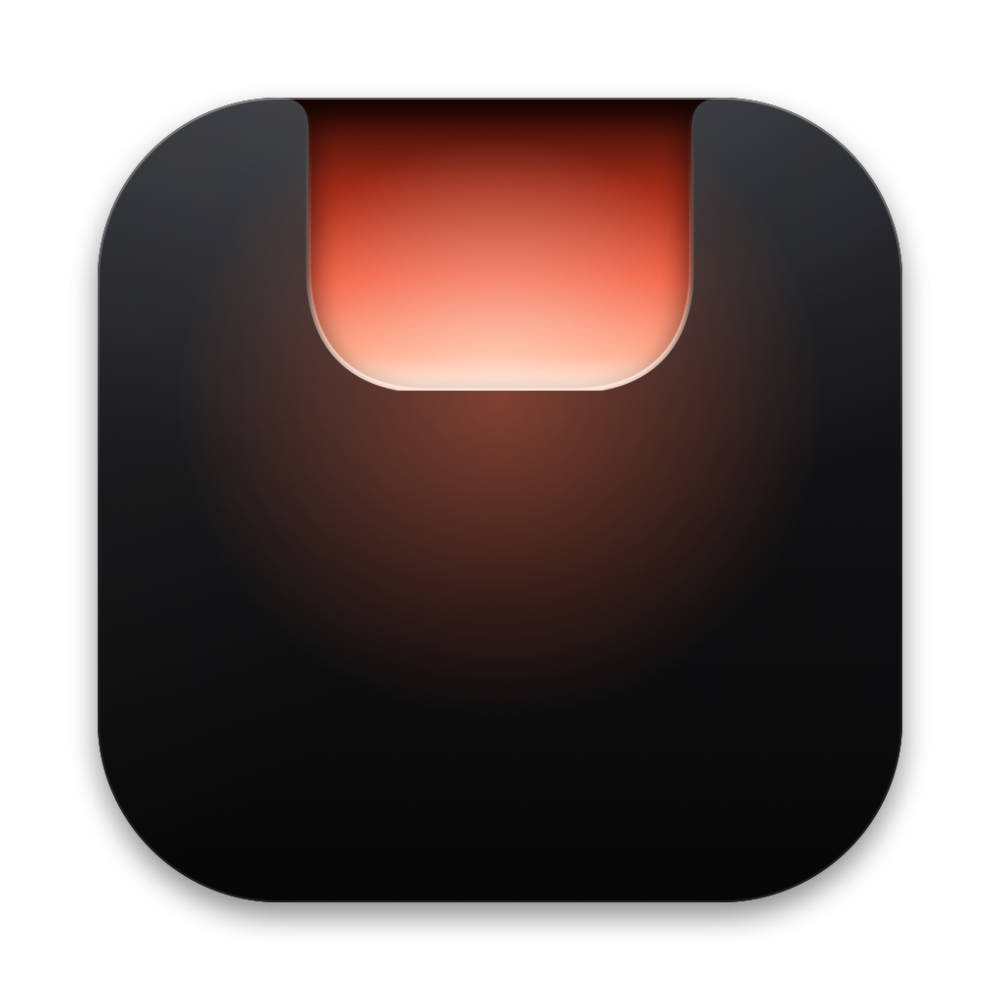
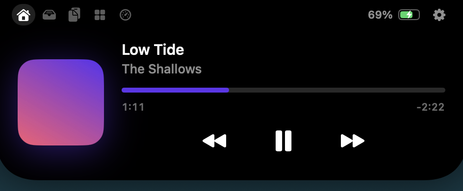
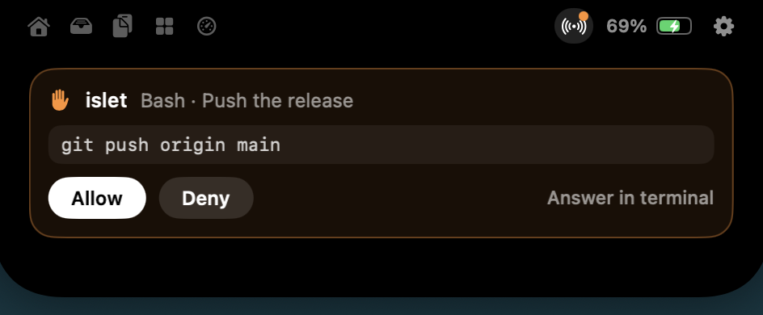

<p align="center"></p>

<h1 align="center">Islet</h1>

<p align="center"><b>The notch, made useful.</b><br>An open source Dynamic Island for the Mac. Native, light, and programmable.</p>

<p align="center"></p>

Islet lives in the camera cutout of your MacBook. Rest the pointer on the notch and it opens; move away and it tucks
back in. While you work, it shows what matters beside the camera: the music playing, the volume, a charger plugged
in, a build running, an agent waiting for you.

## What it does

- **Now playing**: cover, controls and a scrubber for Apple Music, Spotify and any player that reports to macOS.
  The bars beside the camera dance in the colour of the cover.
- **Volume and brightness**: a quiet gauge in the notch instead of the system's big square.
- **Live activities**: charging and low battery, headphones and speakers as they connect, the app using your
  microphone or camera.
- **Shelf and AirDrop**: drop files on the notch, drag them out later, or send them all with AirDrop.
- **Clipboard history**: your last copies, text and images, kept in memory only. Pin the ones you want to keep.
  Copies from password managers are skipped.
- **Agenda**: the next events of the day beside the clock, with a Join button for video calls, and today's
  reminders to tick off.
- **Tools**: a timer that counts down in the notch, a colour picker, and a camera mirror.
- **System**: processor, memory, disk and network at a glance.
- **Programmable**: any script can show its progress in the notch. See [the API](docs/api.md).
- **AI agents**: follow Claude Code, Codex, Gemini CLI and Cursor sessions in the notch, and allow or deny Claude
  Code's and Codex's tools from it. Any other agent or script reports with `islet agent`.
- **AirPods**: a card with the battery of each earbud and the case when they connect.
- **Stays out of the way**: the island never covers the menu bar's items, steps aside in full screen, and floats
  below the menu bar on screens without a notch.
- **Extensions**: small scripts that Islet runs on a schedule. See [extensions](docs/extensions.md).
- **Shortcuts**: show an activity, end it, start a timer, open the island.

<p align="center"></p>

## Light by design

Islet uses about 12 MB of memory and almost no processor time while nothing moves, with every feature on. The island's outline is a Core Animation shape
morphed by the Mac's compositor, the bars and rings that move beside the camera are render-server animations, and
the SwiftUI content of the open island exists only while it is open. Nothing polls the mouse. Details and the
measuring method: [benchmark](docs/benchmark.md).

## Install

Islet needs macOS 14 Sonoma or later. Download `Islet.dmg` from the
[latest release](https://github.com/ruben4reall/islet/releases/latest), open it and drag Islet to Applications. The
app is signed with a Developer ID and notarized by Apple, so it opens without a warning.

On first launch a short tour shows the gestures, lets you pick the modules you want, and then asks only for the
permissions those modules need:

| Permission | Why |
|---|---|
| Accessibility | To take over the volume and brightness keys and show its own display |
| Calendars, Reminders | To show your next events and what is due today |
| Bluetooth | To read the battery of your AirPods and other headphones |
| Camera | Only when you open the mirror |

Islet updates itself with [Sparkle](https://sparkle-project.org): it checks the feed on the website once a day
(you can turn that off in Settings, About) and installs only updates signed with Islet's EdDSA key. Islet itself sends nothing
else over the network.

## Use it from scripts

```sh
islet push build --title "Build" --symbol hammer.fill --tint orange --progress 40%
islet done build
```

Install the command from Islet's settings, or run `Islet.app/Contents/Helpers/islet`. Everything it does goes through
a Unix socket that only your user account can open: [API reference](docs/api.md).

## Connect your AI agents

In Settings, Developers, click Connect next to each agent, or:

```sh
islet hooks install --agent all      # every agent found on this Mac
islet hooks install --agent codex    # or one: claude, codex, gemini, cursor
islet hooks status
```

| Agent | Where Islet adds its hooks | In the notch |
|---|---|---|
| Claude Code | `~/.claude/settings.json` | Sessions, and permission requests with Allow and Deny |
| Codex | `~/.codex/hooks.json` | Sessions, and permission requests with Allow and Deny |
| Gemini CLI | `~/.gemini/settings.json` | Sessions, and a waiting sign when Gemini asks you something |
| Cursor | `~/.cursor/hooks.json` | Agent sessions, their edits and commands |

Islet keeps a backup of each file it edits and leaves everything else in it untouched. Codex runs a new hook only
once you have reviewed it: run `/hooks` in Codex and trust Islet's. When a permission request reaches the island and
you ignore it, or choose Answer in terminal, the agent asks in the terminal as usual. If Islet is not running, the
hooks exit at once and change nothing. Islet never signs in to any AI service.

Chat apps such as ChatGPT or Gemini in the browser offer no hooks, so Islet cannot follow them. Any other agent or
script can report its state with `islet agent`: see the [API reference](docs/api.md#other-agents).

## Build from source

Requirements: Xcode 26 and [XcodeGen](https://github.com/yonaskolb/XcodeGen).

```sh
scripts/build.sh            # Debug build; prints the path of Islet.app
scripts/build.sh Release
swift test --package-path Packages/IsletKit
swift scripts/fake-player.swift   # a silent "now playing" track, to work on media without sound
```

| Folder | What lives there |
|---|---|
| `App/` | Entry point, Shortcuts actions |
| `Packages/IsletKit/Sources/IsletCore` | Geometry, the rules that open and close the island, activities, parsers. No AppKit, fully tested |
| `Packages/IsletKit/Sources/IsletShell` | The panel, Core Animation drawing, SwiftUI pages, system monitors, the socket server |
| `MediaBridge/` | The helper that reads now playing information |
| `CLI/` | The `islet` command |
| `site/` | The website and the update feed |
| `scripts/` | Build, release (`release.sh`, `finish-release.sh`) and the disk image background |

Releases: raise `MARKETING_VERSION` in `project.yml`, add a section to `CHANGELOG.md`, commit, then run
`scripts/release.sh` with `ISLET_TEAM_ID` and a notarization key (see the script's header). Without a team it builds an
ad hoc disk image for local testing.

## Contributing

Issues and pull requests are welcome. Read [CONTRIBUTING.md](CONTRIBUTING.md) first; the short version: keep it light,
keep it native, and test the rules in `IsletCore`.

## License

MIT. Islet is not affiliated with Apple. Dynamic Island and MacBook are trademarks of Apple Inc.
